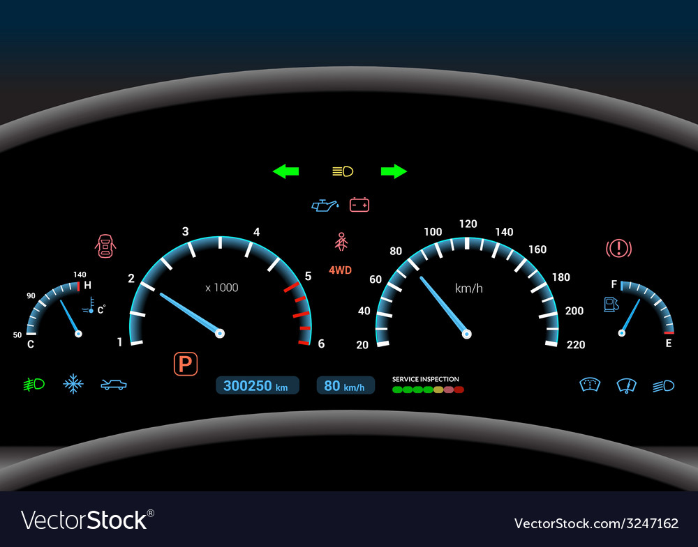
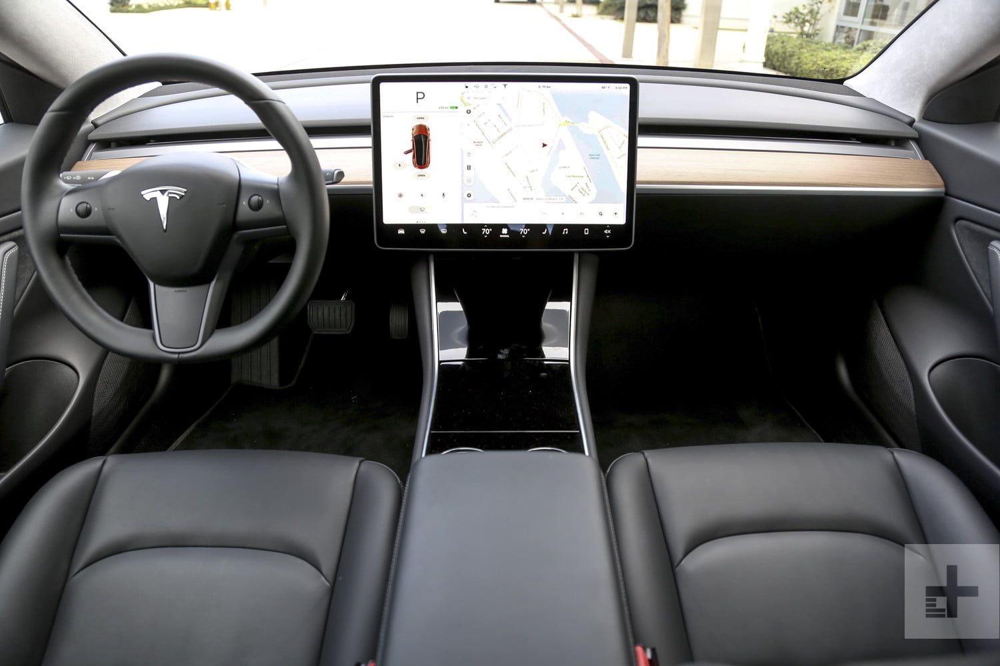
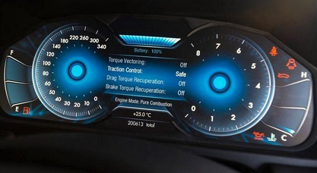
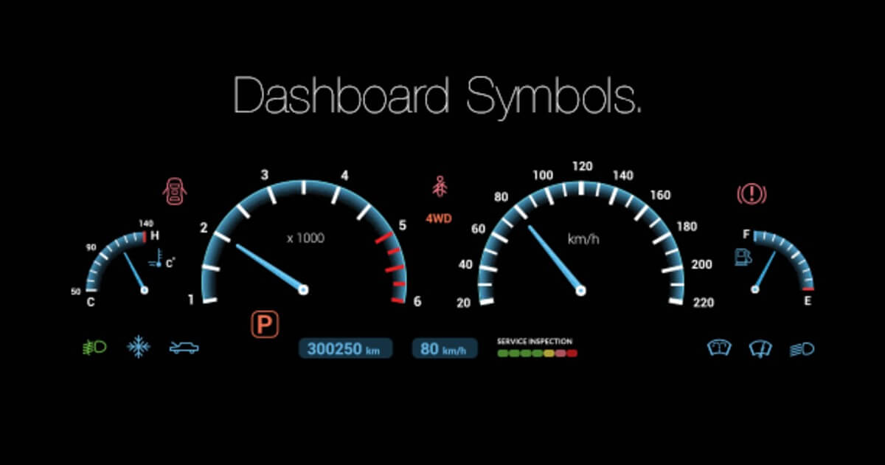
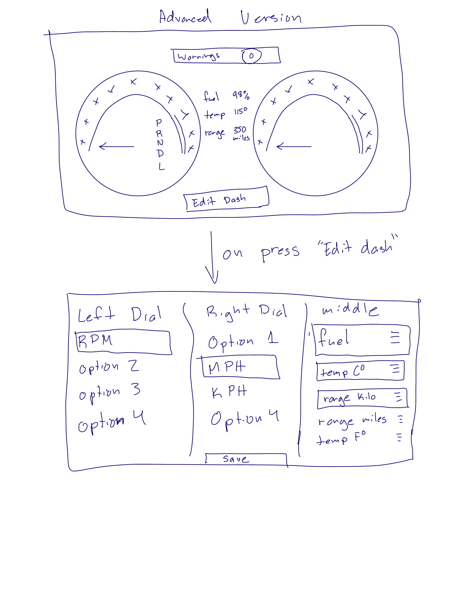
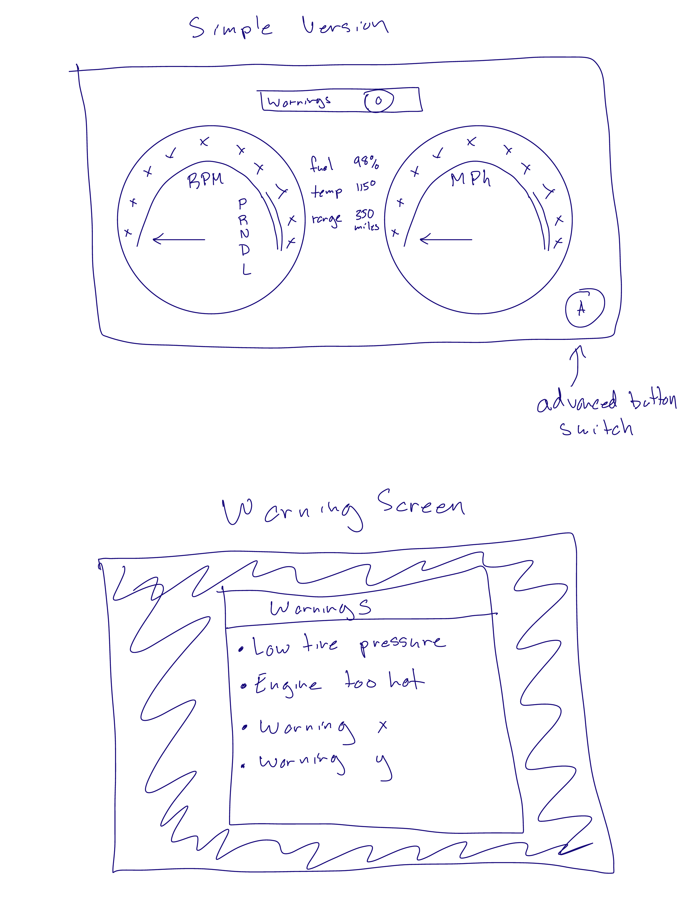

# HCI Project Report
by: Miggy Reyes

## Dashboard Example 1

| Pros | Cons |
| --- | ----------- |
| All information is present | Icons could be hard to decipher |
| Colors are easy to see in the dark | A lot of information is presented at one time |
|  | Does not look like there is a way to change the settings to user's preference |

## Dashboard Example 2

| Pros | Cons |
| --- | ----------- |
| Bottom navigation for easy controlls | Would be hard to navigate mid drive as there is a lot of menu buttons |
| Bright, large display for easy use on the road | Large learning for user |
| Larger buttons for ease of use |  |

## Dashboard Example 3

| Pros | Cons |
| --- | ----------- |
| Icons are easy to decipher | Absence of negative space |
|  | Might not need all of the information on the screen at one time |

## Dashboard Example 4

| Pros | Cons |
| --- | ----------- |
| Simple, only shows the necessities | Very dark, might be harder to read at night, not a lot of contrast |
|  | Does not look very modular for a modern dashboard |

## Dashboard Example 5

| Pros | Cons |
| --- | ----------- |
| Good use of space, overlapping elements with the not important ones being smaller | Old school meters for monitoring state of car (battery, fuel, etc.) |
| Only necessities are present | not modular at all, no room for user preference |

## Most Common Use Cases

* Checking speed
* Checking RPM
* Checking what gear they are in
* Checking the state of their fuel tank

## Rare Common Use Cases

* Checking tire pressure
* Maintenance checks
* Navigation (considering everyone just uses their phone)

## Mistakes with common designs

* Hard to figure out what the symbols mean
* Sometimes UI can get very crowded
* Cannot edit what you see. Important elements might be different for different drivers/cars

## Things to improve

* Android style approach to UI
  * Allow for an advanced user mode and a basic use mode
* Make sure display is bright in the day and dark at night with lots of contrast
* Make most important information (depending on the user) is shown upfront and larger than the rest of the UI
* Create a notification drop down warnings and maintenance

## Low Fidelity Prototype

